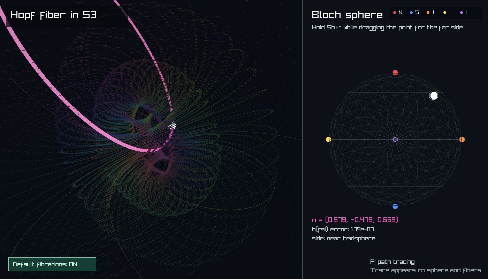

# Hopf-Bloch

Interactive Hopf fibration and Bloch sphere visualizations for exploring how
global phase fibers in `S^3` map down to quantum states on the Bloch sphere.



## What is here

The app is written in C++ with raylib. It runs as a native desktop app during
development and as a WebAssembly/WebGL app on Vercel.

`src/hopf_fibration.cpp` draws the projected Hopf fiber in `S^3` next to an
interactive Bloch sphere picker, with a live inverse-map error check.

## Project Structure

```text
.
|-- README.md
|-- docs/
|   `-- screenshot.png        # README screenshot
|-- public/
|   `-- index.html            # Vercel host page for the C++ WebAssembly app
|-- scripts/
|   |-- build-web.sh          # Emscripten/raylib web build for Vercel
|   |-- build.ps1             # Windows desktop build helper
|   `-- verify-public-build.mjs
|-- package.json
|-- vercel.json
`-- src/
    `-- hopf_fibration.cpp    # Shared desktop and web implementation
```

Native desktop build files go into `build/`, and temporary web toolchains go
into `.webbuild/`. Both are ignored by git.

## Run Locally

The native app is currently set up for Windows with MSYS2 UCRT64, `g++`, and
raylib installed under `C:/msys64/ucrt64`.

```powershell
powershell -ExecutionPolicy Bypass -File .\scripts\build.ps1
.\hopf_fibration.exe
```

Run the math check without opening the visualization:

```powershell
.\build\hopf_fibration.exe --check
```

Expected output is a pair of small floating-point errors for the Hopf map and
unit-length spinor checks.

## Build for Vercel

The Vercel build command is `npm run build`. It runs `scripts/build-web.sh`,
which downloads Emscripten, builds raylib for `PLATFORM_WEB`, and compiles the
C++ app into `public/hopf_bloch.js` and `public/hopf_bloch.wasm`.

```bash
npm run build
```

`vercel.json` serves the generated `public/` directory.

## Controls

- Drag the left view to orbit the projected Hopf fiber.
- Use the mouse wheel on the left view to zoom.
- Drag the white point on the Bloch sphere to choose a state.
- Drag empty space on the Bloch sphere to rotate it.
- Hold `Shift` while dragging to pick the far hemisphere.
- Press `F` to flip the selected point across the current Bloch view.
- Press `P` to start or clear path tracing.
- Use the bottom-left button to show or hide the reference fibration cloud.

## Math Convention

For a Bloch vector

```text
n = (sin(theta) cos(phi), sin(theta) sin(phi), cos(theta))
```

the selected representative spinor is

```text
psi = (sin(theta / 2), exp(i phi) cos(theta / 2)).
```

The highlighted Hopf fiber is the global-phase orbit

```text
exp(i gamma) psi, 0 <= gamma < 2 pi.
```
